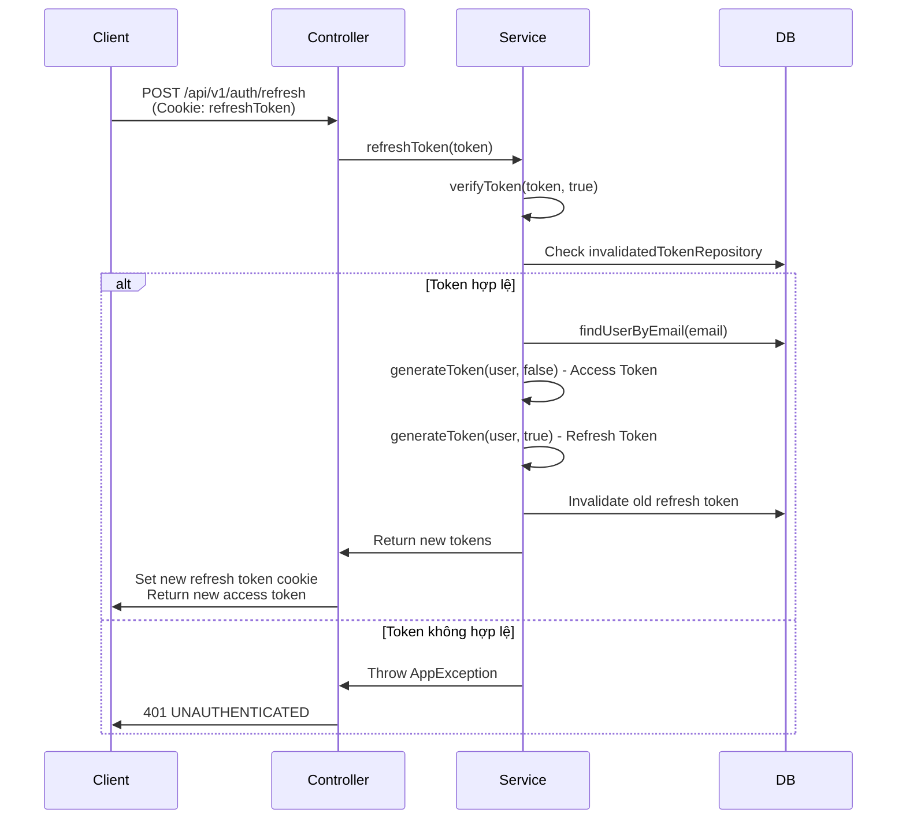

# API Refresh Token - Tài liệu Chi tiết

## Tổng quan

API refresh token đã được triển khai đầy đủ trong dự án của bạn với các tính năng bảo mật cao:

- ✅ Refresh token được lưu trong **HttpOnly Cookie** (bảo vệ khỏi XSS)
- ✅ Token rotation: Mỗi lần refresh sẽ tạo cặp token mới
- ✅ Token invalidation: Token cũ được vô hiệu hóa sau khi sử dụng
- ✅ Secure & SameSite attributes để chống CSRF

## Endpoint

### POST `/api/v1/auth/refresh`

**Mô tả:** Làm mới access token bằng refresh token

**Request:**
- Refresh token được gửi tự động qua Cookie (HttpOnly)
- Không cần body request

**Response thành công (200 OK):**
```json
{
  "code": 200,
  "message": "Token refreshed successfully",
  "data": {
    "token": "eyJhbGciOiJIUzUxMiJ9...",
    "authenticated": true
  }
}
```

**Response lỗi:**
- `401 UNAUTHENTICATED`: Token không hợp lệ hoặc đã hết hạn
- `404 NOT_FOUND`: User không tồn tại

## Luồng hoạt động



## Chi tiết Implementation

### 1. Controller Layer

**File:** [AuthenticationController.java](file:///c:/Users/admin/Desktop/Project/EComercial/backend/project/src/main/java/backend/project/controller/AuthenticationController.java#L68-L95)

```java
@PostMapping("/refresh")
public ApiResponse<AuthenticationResponse> refreshToken(
        @CookieValue(name = "refreshToken") String refreshToken,
        HttpServletResponse response) throws JOSEException, ParseException {
    
    // Gọi service để xử lý refresh token
    AuthenticationResponse authResponse = authenticationService.refreshToken(refreshToken);

    // Tạo cookie mới cho refresh token
    ResponseCookie refreshTokenCookie = ResponseCookie
        .from("refreshToken", authResponse.getRefreshToken())
        .httpOnly(true)      // Không thể truy cập từ JavaScript
        .secure(true)        // Chỉ gửi qua HTTPS
        .path("/api/v1/auth/refresh")  // Chỉ gửi cho endpoint này
        .maxAge(7 * 24 * 60 * 60)      // 7 ngày
        .sameSite("Strict")  // Chống CSRF
        .build();

    response.addHeader(HttpHeaders.SET_COOKIE, refreshTokenCookie.toString());

    return ApiResponse.<AuthenticationResponse>builder()
        .code(HttpStatus.OK.value())
        .message("Token refreshed successfully")
        .data(AuthenticationResponse.builder()
            .token(authResponse.getToken())
            .authenticated(true)
            .build())
        .build();
}
```

### 2. Service Layer

**File:** [AuthenticationService.java](file:///c:/Users/admin/Desktop/Project/EComercial/backend/project/src/main/java/backend/project/service/impl/AuthenticationService.java#L185-L209)

```java
public AuthenticationResponse refreshToken(String refreshToken) 
        throws JOSEException, ParseException {
    
    // 1. Verify refresh token
    SignedJWT signedJWT = verifyToken(refreshToken, true);

    // 2. Lấy thông tin user từ token
    String email = signedJWT.getJWTClaimsSet().getSubject();
    User user = userRepository.findUserByEmail(email)
        .orElseThrow(() -> new AppException(ErrorCode.NOT_FOUND));

    // 3. Tạo cặp token mới
    String newAccessToken = generateToken(user, false);
    String newRefreshToken = generateToken(user, true);

    // 4. Vô hiệu hóa refresh token cũ
    invalidatedTokenRepository.save(InvalidatedToken.builder()
        .id(signedJWT.getJWTClaimsSet().getJWTID())
        .expiryTime(signedJWT.getJWTClaimsSet().getExpirationTime())
        .build());

    return AuthenticationResponse.builder()
        .token(newAccessToken)
        .refreshToken(newRefreshToken)
        .authenticated(true)
        .build();
}
```

### 3. Token Generation

**File:** [AuthenticationService.java](file:///c:/Users/admin/Desktop/Project/EComercial/backend/project/src/main/java/backend/project/service/impl/AuthenticationService.java#L89-L118)

```java
private String generateToken(User user, boolean isRefresh) {
    JWSHeader jwsHeader = new JWSHeader(JWSAlgorithm.HS512);

    // Thời gian hết hạn dựa trên loại token
    Date expirationTime;
    if (isRefresh) {
        // Refresh token: REFRESHABLE_DURATION (days)
        expirationTime = new Date(
            Instant.now().plus(REFRESHABLE_DURATION, ChronoUnit.DAYS).toEpochMilli()
        );
    } else {
        // Access token: VALID_DURATION (minutes)
        expirationTime = new Date(
            Instant.now().plus(VALID_DURATION, ChronoUnit.MINUTES).toEpochMilli()
        );
    }

    JWTClaimsSet jwtClaimsSet = new JWTClaimsSet.Builder()
        .subject(user.getEmail())
        .issueTime(new Date())
        .expirationTime(expirationTime)
        .jwtID(UUID.randomUUID().toString())
        .claim("scope", buildScope(user))
        .claim("tokenType", isRefresh ? "REFRESH" : "ACCESS")
        .build();

    // Sign token
    Payload payload = new Payload(jwtClaimsSet.toJSONObject());
    JWSObject jwsObject = new JWSObject(jwsHeader, payload);
    jwsObject.sign(new MACSigner(SECRET_KEY.getBytes()));
    
    return jwsObject.serialize();
}
```

### 4. Token Verification

**File:** [AuthenticationService.java](file:///c:/Users/admin/Desktop/Project/EComercial/backend/project/src/main/java/backend/project/service/impl/AuthenticationService.java#L148-L183)

```java
private SignedJWT verifyToken(String token, boolean isRefresh) 
        throws JOSEException, ParseException {
    
    MACVerifier jwtVerifier = new MACVerifier(SECRET_KEY.getBytes());
    SignedJWT signedJWT = SignedJWT.parse(token);

    // Tính thời gian hết hạn
    Date expirationTime;
    if (isRefresh) {
        // Refresh token: issue time + refreshable duration
        expirationTime = new Date(
            signedJWT.getJWTClaimsSet().getIssueTime().toInstant()
                .plus(REFRESHABLE_DURATION, ChronoUnit.DAYS).toEpochMilli()
        );
    } else {
        // Access token: sử dụng expiration time từ token
        expirationTime = signedJWT.getJWTClaimsSet().getExpirationTime();
    }

    // Verify signature
    var verified = signedJWT.verify(jwtVerifier);

    // Kiểm tra hết hạn
    if (!verified || expirationTime.before(new Date())) {
        throw new AppException(ErrorCode.UNAUTHENTICATED);
    }

    // Kiểm tra token đã bị vô hiệu hóa chưa
    if (invalidatedTokenRepository.existsById(signedJWT.getJWTClaimsSet().getJWTID())) {
        throw new AppException(ErrorCode.UNAUTHENTICATED);
    }

    return signedJWT;
}
```

## Cấu hình

Các giá trị cấu hình trong `application.properties` hoặc `application.yml`:

```properties
# Secret key để sign JWT
signerKey=your-secret-key-here

# Thời gian hết hạn của access token (phút)
validDuration=30

# Thời gian hết hạn của refresh token (ngày)
refreshableDuration=7
```

## Tính năng bảo mật

### 1. HttpOnly Cookie
- Refresh token được lưu trong HttpOnly cookie
- Không thể truy cập từ JavaScript → Chống XSS

### 2. Secure Flag
- Cookie chỉ được gửi qua HTTPS
- Bảo vệ khỏi man-in-the-middle attacks

### 3. SameSite Strict
- Cookie không được gửi trong cross-site requests
- Chống CSRF attacks

### 4. Token Rotation
- Mỗi lần refresh tạo cặp token mới
- Token cũ bị vô hiệu hóa ngay lập tức

### 5. Token Invalidation
- Token đã sử dụng được lưu vào database
- Ngăn chặn token reuse attacks

### 6. Path Restriction
- Cookie chỉ được gửi cho endpoint `/api/v1/auth/refresh`
- Giảm thiểu attack surface

## Cách sử dụng từ Frontend

### JavaScript/Fetch API

```javascript
async function refreshAccessToken() {
  try {
    const response = await fetch('http://localhost:8080/api/v1/auth/refresh', {
      method: 'POST',
      credentials: 'include', // Quan trọng: Gửi cookie
      headers: {
        'Content-Type': 'application/json'
      }
    });

    if (response.ok) {
      const data = await response.json();
      const newAccessToken = data.data.token;
      
      // Lưu access token mới (localStorage, memory, etc.)
      localStorage.setItem('accessToken', newAccessToken);
      
      return newAccessToken;
    } else {
      // Token không hợp lệ, redirect to login
      window.location.href = '/login';
    }
  } catch (error) {
    console.error('Refresh token failed:', error);
    window.location.href = '/login';
  }
}
```

### Axios Interceptor

```javascript
import axios from 'axios';

// Request interceptor
axios.interceptors.request.use(
  (config) => {
    const token = localStorage.getItem('accessToken');
    if (token) {
      config.headers.Authorization = `Bearer ${token}`;
    }
    return config;
  },
  (error) => Promise.reject(error)
);

// Response interceptor
axios.interceptors.response.use(
  (response) => response,
  async (error) => {
    const originalRequest = error.config;

    // Nếu lỗi 401 và chưa retry
    if (error.response?.status === 401 && !originalRequest._retry) {
      originalRequest._retry = true;

      try {
        // Gọi refresh token
        const response = await axios.post(
          'http://localhost:8080/api/v1/auth/refresh',
          {},
          { withCredentials: true } // Gửi cookie
        );

        const newAccessToken = response.data.data.token;
        localStorage.setItem('accessToken', newAccessToken);

        // Retry request với token mới
        originalRequest.headers.Authorization = `Bearer ${newAccessToken}`;
        return axios(originalRequest);
      } catch (refreshError) {
        // Refresh failed, redirect to login
        localStorage.removeItem('accessToken');
        window.location.href = '/login';
        return Promise.reject(refreshError);
      }
    }

    return Promise.reject(error);
  }
);
```

## Testing với Postman/cURL

### 1. Login để lấy token

```bash
curl -X POST http://localhost:8080/api/v1/auth/login \
  -H "Content-Type: application/json" \
  -d '{
    "email": "user@example.com",
    "password": "password123"
  }' \
  -c cookies.txt
```

### 2. Refresh token

```bash
curl -X POST http://localhost:8080/api/v1/auth/refresh \
  -b cookies.txt \
  -c cookies.txt
```

## Best Practices

### 1. Thời gian hết hạn hợp lý
- **Access token**: 15-30 phút
- **Refresh token**: 7-30 ngày

### 2. Xử lý token expiration
- Implement automatic token refresh trước khi access token hết hạn
- Sử dụng interceptor để tự động retry failed requests

### 3. Logout
- Cần implement endpoint logout để xóa refresh token cookie
- Invalidate cả access token và refresh token

### 4. Security Headers
- Đảm bảo CORS được cấu hình đúng
- Chỉ cho phép trusted origins

### 5. HTTPS trong Production
- **Bắt buộc** sử dụng HTTPS trong production
- Secure flag chỉ hoạt động với HTTPS

## Troubleshooting

### Lỗi: "Cookie not found"
- Đảm bảo `credentials: 'include'` hoặc `withCredentials: true`
- Kiểm tra CORS configuration

### Lỗi: "Token expired"
- Refresh token đã hết hạn
- User cần login lại

### Lỗi: "Token invalidated"
- Token đã được sử dụng trước đó
- Có thể bị token theft, yêu cầu login lại

## Kết luận

API refresh token trong dự án của bạn đã được triển khai với các best practices về bảo mật:

✅ Token rotation để ngăn chặn token reuse  
✅ HttpOnly cookie để chống XSS  
✅ Secure & SameSite để chống CSRF  
✅ Token invalidation để phát hiện token theft  
✅ Proper expiration handling

Hệ thống này đảm bảo tính bảo mật cao cho authentication flow của ứng dụng.
